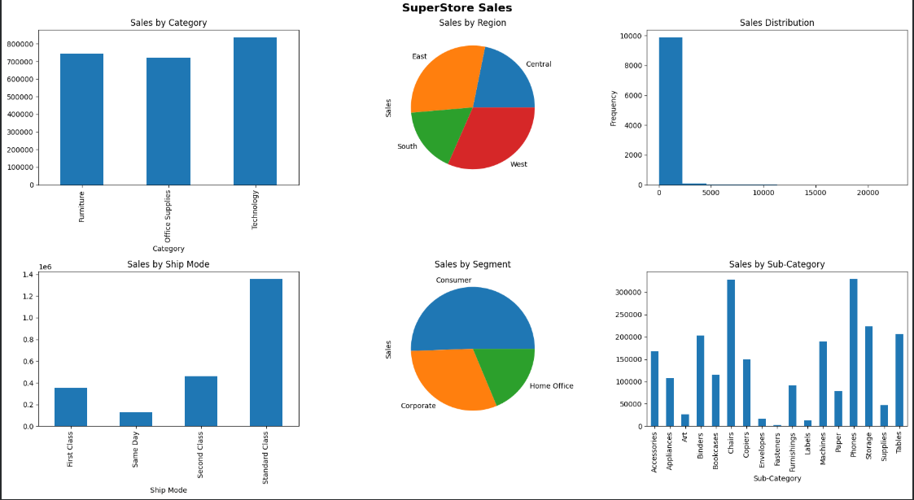

 # Superstore Sales Analysis

##  Project Overview
This project performs Exploratory Data Analysis (EDA) on a retail dataset to uncover sales and profit insights.

##  Steps Performed
- Data cleaning and preprocessing  
- Feature engineering (Year, Month, Shipping Days)  
- Exploratory Data Analysis  
- Profit margin calculation  
- Data visualization  

##  Key Insights
- Technology category has highest sales  
- Consumer segment dominates revenue  
- Standard Class is most used shipping mode  
- Some sub-categories generate losses  

##  Tools Used
- Python  
- Pandas  
- Matplotlib  
- Seaborn  

##  Dashboard Preview

